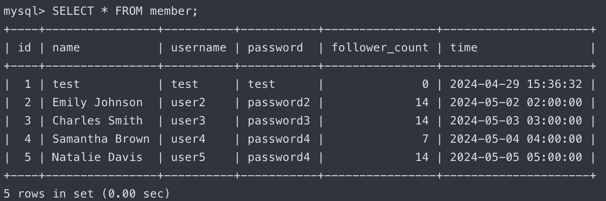

# Task-2：
---
  ```sql
  -- 1. 
  create database website;
  ```
  
  ```sql
  -- 2. 
  CREATE TABLE member
  (
    id BIGINT PRIMARY KEY AUTO_INCREMENT, 
    name VARCHAR(255) NOT NULL, 
    username VARCHAR(255) NOT NULL, 
    password VARCHAR(255) NOT NULL, 
    follower_count INT UNSIGNED NOT NULL DEFAULT 0, 
    time DATETIME NOT NULL DEFAULT NOW()
  );
  ``` 
  
# Task-3：
---
  ```sql
  -- 1
  INSERT INTO member(name, username, password) 
  VALUES("test", "test", "test");
  
  INSERT INTO member(name, username, password, follower_count, time)
  VALUES
    ("Emily Johnson", "user2", "password2", FLOOR(1 + (RAND() * 19)), "2024-05-02 02:00:00"),
    ("Charles Smith", "user3", "password3", FLOOR(1 + (RAND() * 19)), "2024-05-03 03:00:00"),
    ("Samantha Brown", "user4", "password4", FLOOR(1 + (RAND() * 19)), "2024-05-04 04:00:00"),
    ("Natalie Davis", "user5", "password4", FLOOR(1 + (RAND() * 19)), "2024-05-05 05:00:00");
  ```
  ```sql
  -- 2
  SELECT * FROM member;
  ```
  
  ```sql
  -- 3
  SELECT * FROM member ORDER BY time DESC;
  ```
  
  ```sql
  -- 4
  SELECT * FROM member ORDER BY time DESC LIMIT 1, 3;
  ```
  
  ```sql
  -- 5
  SELECT * FROM member WHERE username="test";
  ```
  
  ```sql
  -- 6
  SELECT * FROM member WHERE name LIKE "%es%";
  ```
  
  ```sql
  -- 7
  SELECT * FROM member WHERE username="test" and password="test";
  ```
  
  ```sql
  -- 8
  UPDATE member SET name="test2" WHERE username="test";
  ```
  
# Task-4：
---
  ```sql
  -- 1
  SELECT COUNT(*) FROM member;
  ```
  
  ```sql
  -- 2
  SELECT SUM(follower_count) FROM member;
  ```
  
  ```sql
  -- 3
  SELECT AVG(follower_count) FROM member;
  ```
  
  ```sql
  -- 4
  SELECT AVG(follower_count) AS AVG_follower_count FROM (SELECT follower_count FROM member ORDER BY follower_count DESC LIMIT 2) as Top_2_follower_count;
  ```
  
# Task-5：
---
  ```sql
  -- 1
  CREATE TABLE message
  (
    id BIGINT PRIMARY KEY AUTO_INCREMENT,
    member_id BIGINT NOT NULL,
    content VARCHAR(255) NOT NULL,
    like_count INT UNSIGNED NOT NULL DEFAULT 0,
    time DATETIME NOT NULL DEFAULT NOW(),
    FOREIGN KEY(member_id) REFERENCES member(id)
  );
  ```
  
  ```sql
  -- 2
  SELECT message.id, member_id, name, content, like_count, message.time FROM message INNER JOIN member ON message.member_id=member.id;
  ```
  
  ```sql
  -- 3
  SELECT message.id, member_id, name, content, like_count, message.time FROM message INNER JOIN member ON message.member_id=member.id WHERE username="test";
  ```
  
  ```sql
  -- 4
  SELECT AVG(like_count) FROM message INNER JOIN member ON message.member_id=member.id WHERE username="test";
  ```
  
  ```sql
  -- 5
  SELECT username, AVG(like_count) FROM message INNER JOIN member ON message.member_id=member.id GROUP BY username;
  ```
  

